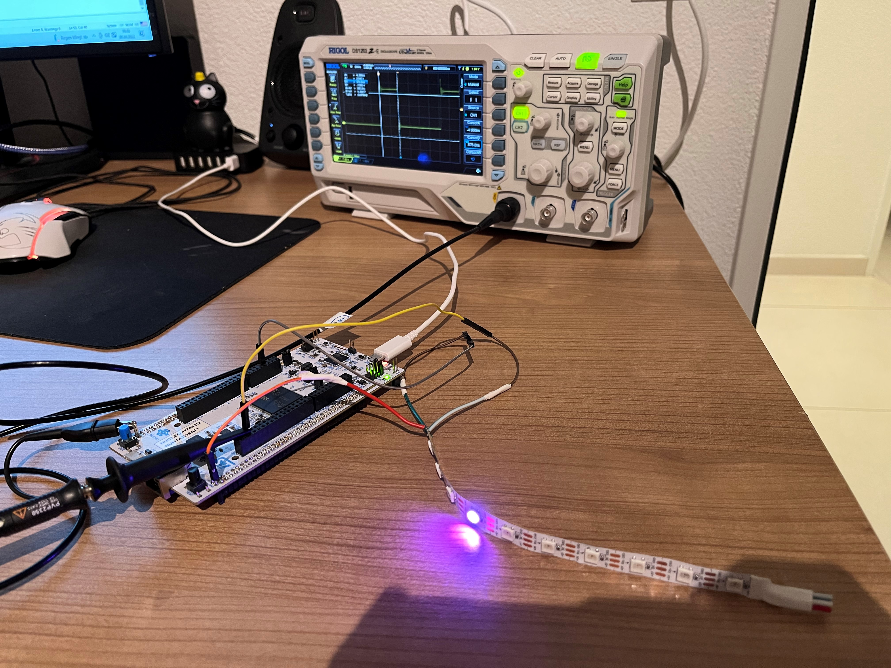
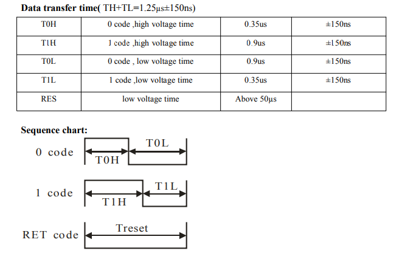
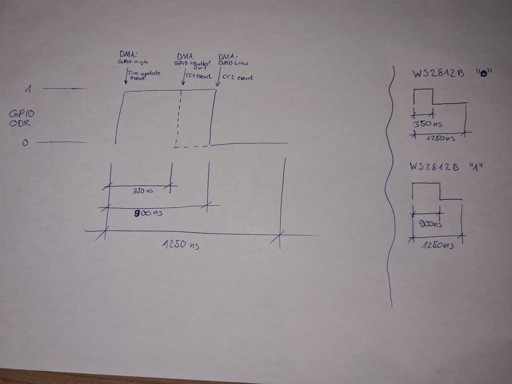

# STM32H7XX_WS2812B

This is an example code of controlling a ws2812b led stripe
with 10 leds thus the used driver is configured as 1 row with 10
cols. You can change row and col in the ws2812b header file.
You can connect up to 16 led stripes. Data is written in
parallel to the stripes from a GPIO Bank (GPIO A in this example)
This is why up to 16 stripes can be controlled in parallel.
A Timer is used in which 3 DMA transfer are triggered used to 
write data to the gpio's on which the stripes are connected to.
This 3 DMA transfer are triggered as following:
First trigger is on each timer update event. It sets all gpio pins to high.
Second trigger is on the first capture compare event on the 9th
tick/pulse. The GPIOS are set accordingly if the bit for the
ws2812b shall be a 1 or a 0. 
The third trigger is the second capture compare event and sets
all gpio pins always to 0 through a dma transfer. It doesn't matter
if the pins are already set to 0 by the first capture compare
event.
Please read the ws2812b datasheet to understand the communication
protocol with the ws2812b led chips.
This example is programmed in the IAR Embedded Workbench IDE for
a Nucleo STM32H743 Board. 
But you can use this library for any other IDE or stm32 
microcontroller. Just be sure to set the correct DMA
streams/channels, otherwise it won't work.

